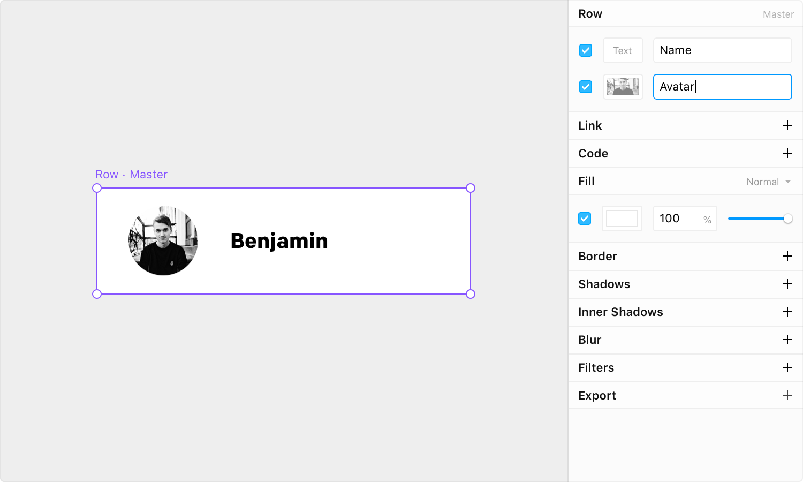
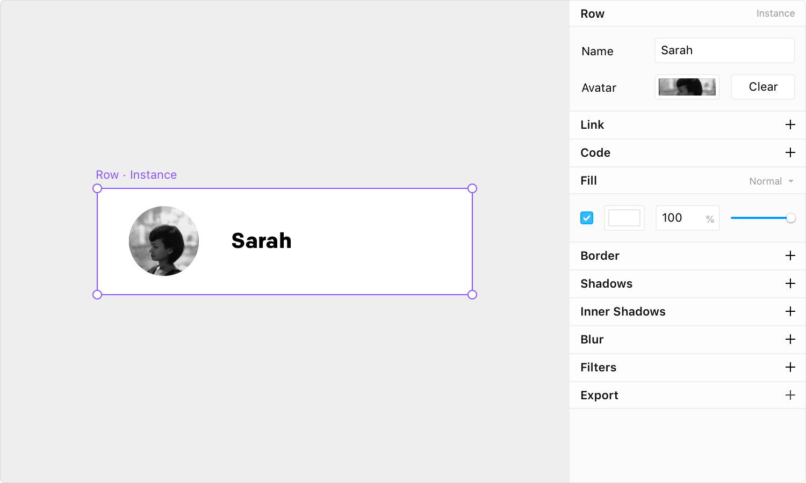
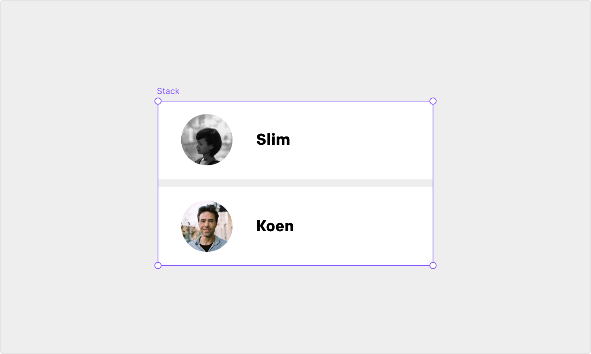

# Design Components

## Design Components

Design Components are a powerful feature of Framer X to turn any part of your canvas into a re-usable element that propagates its changes to any copy. They allow you to create repetitive designs very efficiently.

To create a design component, select any Frame on your canvas and select the “Components” panel on the left. There, click “Create Component” on the bottom and select “from Design”. You can also use the shortcut `⌘`+`K` on any selection. After you created the component, it will show up in the Components panel.

Design Components have one master and as many instances as you like. To create instances drag them from the Components panel onto the canvas, or hold the Option key and drag a master or instance to duplicate. When you edit the master, you will see the changes propagate to all instances.

## Overrides

Design Component instances can have overrides where they visually differ from the master. To override any instance double click it and make edits like you normally would. If you now edit the master, you’ll notice the overridden properties do not get updated anymore, but everything else will.

Additionally to freeform overrides, you can also add managed overrides to design components to create a custom property interface in the properties panel. Framer X detects any Text layers and Frames with an image fill in your component hierarchy and lets you define their contents as properties. This is great for when you want to create easily configurable components without editing them on the canvas.

Let’s create a simple card with a profile image and a name and turn it into a design component. If you select the master, you will see a section Row / Master in the properties panel with two label fields, a text and image field. Name the text field `Name` and the profile `Avatar` and enable them as properties.



Now every instance of the Row component has two custom property fields in the properties panel that you can easily configure from the interface. Obviously you can still directly edit them from the canvas too and they will stay in sync.



## Exporting / Importing from Code

Every design component gets exported automatically, making it importable from code. This offers great flexibility as you can express them dynamically with loops to create dynamic lists or grids with real data.


Make sure you setup [VSCode for external editing](https://framer.gitbook.io/framer/~/edit/drafts/-LKS1WMROLkDNccBN9iI/application#setup).


Let’s start with the design component we created for Overrides in the previous paragraph. Make sure you name your design component in the layer panel, in this case Row . As soon as you name the component, code for it gets exported in the file `code/canvas.ts`.

From there we can import it into any other code file like `import { Row } from "./canvas"`. The imported Row is a React component with the properties you defined in the master, in this case profile and title. Using the component will look like any other component:

```typescript
<Row profile="profile.png" title="Sara" />
```

Let’s try to make a list with the Row component based on an array. Start by creating a new code component from the Component panel and adding the following contents:

```typescript
import * as React from "react";
import { Stack } from "framer";
import { Row } from "./canvas";

export class Test extends React.Component<{ width: number; height: number }> {
  render() {
    const { width, height } = this.props;
    const names = ["Slim", "Koen"];

    return (
      <Stack width={width} height={height}>
        {names.map(name => (
          <Row title={name} />
        ))}
      </Stack>
    );
  }
}
```

We are using our `Stack` component to build a vertical list based on a loop of the names array. You can add or remove items and see the component reflect it on your canvas. A great way to dynamically build components based on visual components with real data.




In the future, you can import the design components from any React project, so you’ll be able to export and use visual components from Framer X anywhere.


## Store Publishing

Every design component you make ends up as a component in the [package](../code/packages.md), including the custom override properties. This is a great way to make dynamic visual components without having to write any code.

Make sure to properly name your visual components so they can be organized and filtered in the components panel. You can change a component name from the layer panel.
